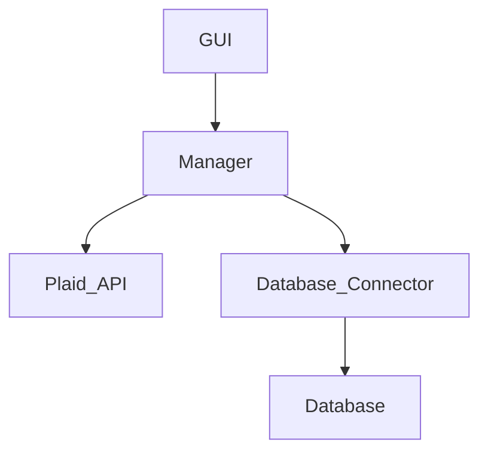

Excuse the Messiness.  This is a personal finance app in the making.

# Core Architecture Diagram

# Intro
```bash
make up
```

# API

## Balances

### GET_BALANCES
  """ Returns a given month's last recorded balances

  Produces: 
    balances: list[dict], [{institution: str, balance: int, last_updated: str},
                           {institution: str, balance: int, last_updated: str},
                           {...}, ...
                          ]
  """
# Monthly Flow


# Transactions


Features Idea list:
- List transactions
- Tally total net worth
- compare best prices for something
- Receipt OCR, NLP, and Information Extraction: https://medium.com/one9-tech/information-extraction-receipt-ocr-scan-deep-learning-1e68ce5a9ae7


steps to run quickstart from scratch:
- clone the repo
- copy cookbook.secrets.template.py and fill in plaid secrets. You can get your access tokens by running the get-started from the plaid-quickstart git repo.
- make start-db
- make update (updates the database)
- make analyze (analyzes the current month's transactions)
- make write (write's current month's transactions to an excel sheet)


TO-DO reminders:
- Improve documentation
- only update balances with timestamps more than a day old
- check to make sure all item's accounts are being written into the database/shown in the gui
- make sure transaction cursor is being updated
  - transaction categorizations are re-written upon updating transactions
- clean up plaiddb database with nested objects.  Have `Item` objects with all the related information
- create a system config instead of various Make commands

Notes:
- the explore target simply runs the src/explore script for easily executing code in the container... should maybe just attach to the container to start with or something
- Radio buttons in table: https://discuss.streamlit.io/t/make-streamlit-table-results-hyperlinks-or-add-radio-buttons-to-table/7883/11

DB Schema:

DB - Collection - Document
PlaidDB
  - userTokens
    - link_token
    - plaid_client_id
    - plaid_secret
  - itemTokens
    - chase
    - alliant
    - discover
  - transactionCursors
    - cursor/last_updated/bank_name
TransactionsDB
  - april_2023
    - ...
MonthlyDB
  - april_2023
